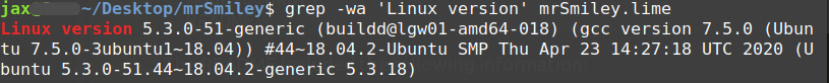

# The Truth About Mr. Smiley Walkthrough

There are many ways to go about solving this challenge, some more creative then others. The following is just one of the many possible methods.

## Synopsis
In an attempt to snag a copy of the upcoming Geography midterm, we stumbled upon a strange truth about our teacher. The student newspaper “The Severity High Tattler” wants an exclusive on what you found, but you need to gather all the evidence you can before they can go to print.

# Solution

After downloading and extracting the challenge player were faced with the following 3 files:

	- mrsmiley.lime
	- module.dwarf
	- README

The README included the following information:

```
Managed to get you the dwarf dump, but your gonna need to get the System map on your own. Wonder what kernel release it might be?
```
A little research and we can quickly discover that the .lime extension can be related back to the Linux Memory Extractor [LiME](https://github.com/504ensicsLabs/LiME). A little more and we can discover that we can use a memory forensics tool called [Volatility](https://github.com/volatilityfoundation/volatility) to analyze this file. However, Volatility requires a profile associated with the system the memory was extracted from, and consists of two files:

	1. module.dwarf - containing the kernel's data structures. (this file was supplied)
	2. System.map - debug symbols for the kernel we want to analyze.

This is are first problem, we need to get the correct system map, one that matches the kernel running on Mr. Smiley's computer.

## Determining The Correct System.map

This requires a bit of digging in a massive binary file, the simplest way I could think of was to simply grep for the linux version:

```
$ grep -wa 'Linux version' mrSmiley.lime
```
Now sure we are gonna get more then we need out of this, but right off the bat we get exactly the information we are looking for.



From the output above we can determine the system map we need has the following criteria:
	
	- Ubuntu 5.3.0-51.44~18.04.2-generic
	- 64 bit
	
Now we need to get a copy of the system map, best way to get it is directly from the Ubuntu repository: 

[kernel-image-5.3.0-51-generic-di\_5.3.0-51.44~18.04.2\_amd64.udeb](http://archive.ubuntu.com/ubuntu/pool/main/l/linux-hwe/kernel-image-5.3.0-51-generic-di_5.3.0-51.44~18.04.2_amd64.udeb)

We can extract the system map from the archive, zip it together with the module.dwarf that was given and add it to volatility (/volatility/plugins/overlays/linux/Ubuntu5.3.0-51.zip). You can then test your volatility to make sure it is seeing your profile:

```
./vol.py --info | Linux
```
## Analyzing the Memory

Now that we have a working profile it's time to dig in! 

Because of the size of the lime file it will take volatility some time to execute a plugin (averaged about 7 min for me, but this is dependent on plugin and the system your running on).

### Flag Geo 1

To retrieve the first flag use the plugin linux\_lsmod, this will list all the loaded modules. _(A simpler way to retrieve this flag is simply to run strings on the file and grep for FLAG)_

```
$ ./vol.py --profile=LinuxUbuntu5_3_0-51x64 -f ~/Downloads/mrSmiley/mrSmiley.lime -vd linux_lsmod
```
This gives the following output:

```
ffffffffc0adf040 FLAG{3XTR@CT10N_M0DUL3} 24576
ffffffffc08c2040 nls_iso8859_1 16384
ffffffffc0a22280 intel_rapl_msr 20480
ffffffffc08da540 intel_rapl_common 24576
ffffffffc08ce180 x86_pkg_temp_thermal 20480
ffffffffc08e4140 intel_powerclamp 20480
ffffffffc0aff100 coretemp 20480
ffffffffc0a89500 kvm_intel 245760
ffffffffc09f10c0 kvm 655360
ffffffffc080e100 joydev 28672
ffffffffc0806080 input_leds 16384
ffffffffc0801040 irqbypass 16384
ffffffffc09744c0 snd_hda_codec_hdmi 57344
ffffffffc0961240 crct10dif_pclmul 16384
ffffffffc0850240 crc32_pclmul 16384
ffffffffc08b7540 snd_hda_codec_realtek 118784
ffffffffc07ec440 ghash_clmulni_intel 16384
ffffffffc094cdc0 aesni_intel 372736
ffffffffc089c400 snd_hda_codec_generic 81920
ffffffffc07dd000 ledtrig_audio 16384
ffffffffc0887e40 snd_hda_intel 53248
ffffffffc07d1080 snd_intel_nhlt 20480
ffffffffc087c1c0 aes_x86_64 20480
ffffffffc086e3c0 snd_hda_codec 131072
ffffffffc08451c0 snd_hda_core 90112
ffffffffc07b7080 snd_hwdep 20480
ffffffffc082f580 snd_pcm 102400
ffffffffc07a3040 crypto_simd 16384
ffffffffc0815100 cryptd 24576
ffffffffc07fc000 glue_helper 16384
ffffffffc07f7180 snd_seq_midi 20480
ffffffffc07f1040 snd_seq_midi_event 16384
ffffffffc07e6240 snd_rawmidi 36864
ffffffffc07d8440 dcdbas 20480
ffffffffc07c7340 snd_seq 69632
ffffffffc0749140 snd_seq_device 16384
ffffffffc07b00c0 snd_timer 36864
ffffffffc0792340 snd 86016
ffffffffc0744000 soundcore 16384
ffffffffc077d900 mei_hdcp 24576
ffffffffc079db80 intel_cstate 20480
ffffffffc0771880 intel_rapl_perf 20480
ffffffffc073e7c0 mei_me 40960
ffffffffc0767400 mei 102400
ffffffffc07521c0 lpc_ich 24576
ffffffffc0734140 ie31200_edac 16384
ffffffffc072a2c0 mac_hid 16384
ffffffffc07251c0 serio_raw 20480
ffffffffc0705140 sch_fq_codel 20480
ffffffffc06fe2c0 parport_pc 40960
ffffffffc06f0340 ppdev 24576
ffffffffc06e5140 lp 20480
ffffffffc06dd500 parport 53248
ffffffffc06bd280 ip_tables 32768
ffffffffc06b2380 x_tables 40960
ffffffffc06a8800 autofs4 45056
ffffffffc0673180 btrfs 1236992
ffffffffc029e0c0 xor 24576
ffffffffc056c000 zstd_compress 163840
ffffffffc0337000 raid6_pq 114688
ffffffffc0220040 libcrc32c 16384
ffffffffc0268280 dm_mirror 24576
ffffffffc01f1040 dm_region_hash 20480
ffffffffc01e3180 dm_log 20480
ffffffffc01fd1c0 hid_logitech_hidpp 40960
ffffffffc01a4200 hid_logitech_dj 24576
ffffffffc01e8140 hid_generic 16384
ffffffffc01dc900 usbhid 53248
ffffffffc01cbe80 hid 126976
ffffffffc01af4c0 uas 28672
ffffffffc019aac0 usb_storage 77824
ffffffffc0504840 i915 1937408
ffffffffc0189000 i2c_algo_bit 16384
ffffffffc035f680 drm_kms_helper 180224
ffffffffc0182000 syscopyarea 16384
ffffffffc017b040 sysfillrect 16384
ffffffffc0174000 sysimgblt 16384
ffffffffc033e040 fb_sys_fops 16384
ffffffffc02f54c0 drm 491520
ffffffffc0292ac0 psmouse 151552
ffffffffc0257000 e1000e 253952
ffffffffc021b8c0 ahci 40960
ffffffffc020b580 libahci 32768
ffffffffc016c240 video 49152
```
There we have the first flag __FLAG{3XTR@CT10N_M0DUL3}__.

### Flag Geo 2

This flag takes a couple steps.

__First: Looking at the bash\_history__

``` 
$ ./vol.py --profile=LinuxUbuntu5_3_0-51x64 -f ~/Downloads/mrSmiley/mrSmiley.lime -vd linux_bash
```
Output:

```
 2817 bash                 2020-05-10 07:21:08 UTC+0000   ./truecrypt-7.1a-setup-x64 
    2817 bash                 2020-05-10 07:21:08 UTC+0000   ls -la 
    2817 bash                 2020-05-10 07:21:08 UTC+0000   ifconfig
    2817 bash                 2020-05-10 07:21:08 UTC+0000   ifconfig
    2817 bash                 2020-05-10 07:21:08 UTC+0000   sudo apt install build-essentials
    2817 bash                 2020-05-10 07:21:08 UTC+0000   sudo truecrypt -d
    2817 bash                 2020-05-10 07:21:08 UTC+0000   sudo apt install libc6-dev
    2817 bash                 2020-05-10 07:21:08 UTC+0000   ??xl?N!%
    2817 bash                 2020-05-10 07:21:08 UTC+0000   reboot
    2817 bash                 2020-05-10 07:21:08 UTC+0000   sudo truecrypt -k syllebus_X_scoringKey.pdf geo_syllebus_X.pdf 
    2817 bash                 2020-05-10 07:21:08 UTC+0000   sudo apt install libc6
    2817 bash                 2020-05-10 07:21:08 UTC+0000   sudo truecrypt 
    2817 bash                 2020-05-10 07:21:08 UTC+0000   sudo insmod lime-5.3.0-51-generic.ko "path=tcp:4444 format=lime timeout=0"
    2817 bash                 2020-05-10 07:21:08 UTC+0000   P??y
    2817 bash                 2020-05-10 07:21:08 UTC+0000   ls
    2817 bash                 2020-05-10 07:21:08 UTC+0000   sudo truecrypt -k syllebus_X_scoringKey.pdf geo_syllebus_X.pdf 
    2817 bash                 2020-05-10 07:21:08 UTC+0000   ifconfig
    2817 bash                 2020-05-10 07:21:08 UTC+0000   sudo apt install build-essential
    2817 bash                 2020-05-10 07:21:08 UTC+0000   ifconfgi
```

Looking at the bash\_history we can note a very telling line:

```
sudo truecrypt -k syllebus_X_scoringKey.pdf geo_syllebus_X.pdf
```

According to the TrueCrypt manual the ```-k``` flag indicates a key file, so these two files might not be PDFs at all. So next we need to extract these two files if we can.

__Locating the syllebus\_X\_scoringKey.pdf and geo\_syllebus\_X.pdf files__

``` 
$ ./vol.py --profile=LinuxUbuntu5_3_0-51x64 -f ~/Downloads/mrSmiley/mrSmiley.lime -vd linux_enumerate_files > Files.text
```
Output: [Files.text](Files.text)

From this we can see where the two files are located:

```
     Inode Address Inode Number              Path
------------------ ------------------------- ----
0xffff8f718c0a0d90                   3014670 /home/mrsmiley/syllebus_X_scoringKey.pdf
0xffff8f72011c37c0                   3014681 /home/mrsmiley/geo_syllebus_X.pdf
```
Now we have enough information to extract them:

``` 
$ ./vol.py --profile=LinuxUbuntu5_3_0-51x64 -f ~/Downloads/mrSmiley/mrSmiley.lime -vd linux_find_file --inode=0xffff8f718c0a0d90 -O ~/Downloads/mrSmiley/syllebus_X_scoringKey.pdf
```

``` 
$ ./vol.py --profile=LinuxUbuntu5_3_0-51x64 -f ~/Downloads/mrSmiley/mrSmiley.lime -vd linux_find_file --inode=0xffff8f72011c37c0 -O ~/Downloads/mrSmiley/geo_syllebus_X.pdf
```
Then we can take a look at Mr. Smiley's disguised TrueCrypt volume. _(If you don't have TrueCrypt you can get a copy [here](https://www.grc.com/misc/truecrypt/truecrypt.htm))_

Unlocking and mounting the TrueCrypt volume we see the following files:
```
.
├── AlwaysAndForever.txt
├── CadyBaby.jpeg
├── image3.jpeg
├── image4.jpeg
├── image6.jpeg
├── image7.jpeg
├── imgae5.jpeg
└── Plastics.jpeg
```
Reading Mr. Smiley's disturbing love letter to Lindsay Lohan's Mean Girls character Cady we find the second flag: __FLAG{1-H3@RT-L1ND5@Y3}__

### Flag Geo 3

What better way to learn someone secrets then to take a little dive into there email. From the previous flag we got a list of files from the dump, exploring this list a little closer we can see that Mr. Smiley is running the Thunderbird mail client. From his Local Folders we can sneak a peek at his Trash folder.

 
``` 
$ ./vol.py --profile=LinuxUbuntu5_3_0-51x64 -f ~/Downloads/mrSmiley/mrSmiley.lime -vd linux_find_file --inode=0xffff8f720200f708 -O ~/Downloads/mrSmiley/LocalMailTrash
```
Here we can find a telling email with the following body:

```
Dear Mr. Smiley=0A=0AThis letter has been served as a notice of your unwarr=
anted harassment activities, or the equivalent thereof, that has been on-go=
ing in recent weeks. Therefor, you are required to cease and desist all ver=
bal and digital attacks, including but not limited to: =0A- Online stalking=
 of Ms Lohan.=0A- Emails and social networking communications to any of Ms =
Lohan's accounts.=0A- Telephone calls to Ms. Lohan.=0AThe previous conducte=
d actions are unwanted, unwelcome, and have become unbearable. Due to the a=
forementioned harm you have caused, this cease and desist shall serve as a =
pre-suit letter demanding that you provide us written assurance within 30 d=
ays that you will refrain from further actions that could be deemed as hara=
ssment.=0A=0ASincerely,=0A=0AHamelton & Ivanivatch Lawfirm=0A10 Grand Centr=
al =0A155 East 44th Street,=0ASuite 1910, New York,=0A NY 10017 =0ARkxBR3tD=
UkA1M0QtNVRATEszUiF9=0A=0A=0A=0A=0A=0A----=0ASent using Guerrillamail.com=
=0ABlock or report abuse: https://www.guerrillamail.com//abuse/?a=3DTFM6FgA=
JT7EMqAO1%2BXJRcRvK=0A
```
Cleaning up the formatting, replacing ```=0A``` with ```\n\r```, and reconnecting lines split with ```=``` the letter becomes much easier to read.
```
Dear Mr. Smiley

This letter has been served as a notice of your unwarranted harassment activities, or the equivalent thereof, that has been on-going in recent weeks. Therefor, you are required to cease and desist all verbal and digital attacks, including but not limited to: 
- Online stalking of Ms Lohan.
- Emails and social networking communications to any of Ms Lohan's accounts.
- Telephone calls to Ms. Lohan.
The previous conducted actions are unwanted, unwelcome, and have become unbearable. Due to the aforementioned harm you have caused, this cease and desist shall serve as a pre-suit letter demanding that you provide us written assurance within 30 days that you will refrain from further actions that could be deemed as harassment.

Sincerely,

Hamelton & Ivanivatch Lawfirm
10 Grand Central 
155 East 44th Street,
Suite 1910, New York,
 NY 10017 
 RkxBR3tDUkA1M0QtNVRATEszUiF9


----
Sent using Guerrillamail.com
Block or report abuse: https://www.guerrillamail.com//abuse/?aDTFM6FgAJT7EMqAO1%2BXJRcRvK
```
The strange run of letters and numbers after the lawyers address deserve some further investigation. A quick trip over to [CyberChef](https://gchq.github.io/CyberChef/) and we quickly identify this as the base64 encoding of __FLAG{CR@53D-5T@LK3R!}__

### Flag Geo 4

For this flag we need to explore Mr. Smiley's browser history. If we take a look at the ```/home/mrsmiley/.mozilla/firefox/obu0qcyo.default-release/places.sqlite``` file there is a little hint waiting for us.


When we go to h4csquared.org we see the following:


However, it looks like this site is using cookies. Maybe we can get lucky and Mr. Smiley's cookie is still valid, that means we need to find his cookie first. We come up short in the ```/home/mrsmiley/.mozilla/firefox/obu0qcyo.default-release/cookies.sqlite``` but all is not lost, ```/home/mrsmiley/.mozilla/firefox/obu0qcyo.default-release/sessionstore-backups/recovery.baklz4``` gives us another (slightly more difficult) way to get our hands on the desired cookie. 

Using a tool like [Fx File Utilities](https://www.jeffersonscher.com/ffu/scrounger.html) we can give this file a lot more human readable meaning, allowing us to discover right at the bottom the info we are looking for:

```json
{
	"host":"h4csquared.org",
	"value":"b63oc298jm5o8kjmacgacbst93",
	"path":"/",
	"name":"PHPSESSID",
	"originAttributes":
	{
		"firstPartyDomain":"",
		"geckoViewSessionContextId":"",
		"inIsolatedMozBrowser":false,
		"privateBrowsingId":0,
		"userContextId":0
	}
}
```

Now if we head over to h4cSquared.org, open our developer tools and replace our PHPSESSID with the one given above "b63oc298jm5o8kjmacgacbst93". We can then reload the page and see what it was Mr. Smiley was looking at:

 


### Flag Geo 5

There are many quick and dirty ways to discover this flag _(this is why the point value was low)_, for simplicity sake, given that you already have access to the places.sqlite file and you know the original reason for investigating Mr. Smiley's computer was to get your hands on a copy of the Midterm test. You can use the URL with the title "Midterm Test" from the places.sqlite file and paste it into your browser:


From here you can see the important part of the document. However, __SYNT{F3PE3G5-Y05G}__ is the right format but not the right letters. Any CTF veteran should quickly realize that __SYNT__ is simply a ROT13 shift of __FLAG__. Shifting the full value we get the final flag __FLAG{S3CR3T5-L05T}__.

_Credit to the solution of this flag goes to the teams who reached out to me while solving this flag! This was a much simpler way then I had planed for this flag! Cheers!_

